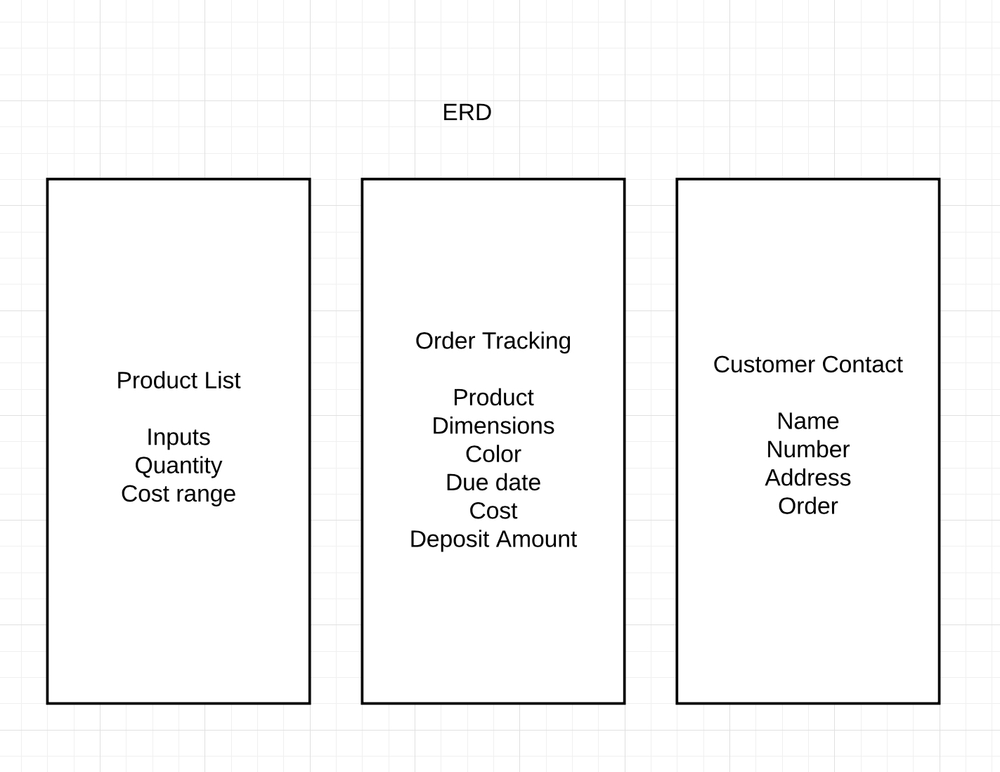

# Peck'n Woods Management System

### General Assembly SEI 26- Project 4

* Trello board- https://trello.com/b/gpEIaTyb/project-4
  
* Git hub- https://git.generalassemb.ly/bellajco/Project4

* Link to deployed site- https://pecknmanage.herokuapp.com/

## Overview
Peck'n Woods Management was created to aid in the management of products, orders, and and customer information for my furniture building company.  

## Technology Used

* JavaScript, React, HTML, CSS, MVC

#ERD:

#WireFrame:

#Final Product:
